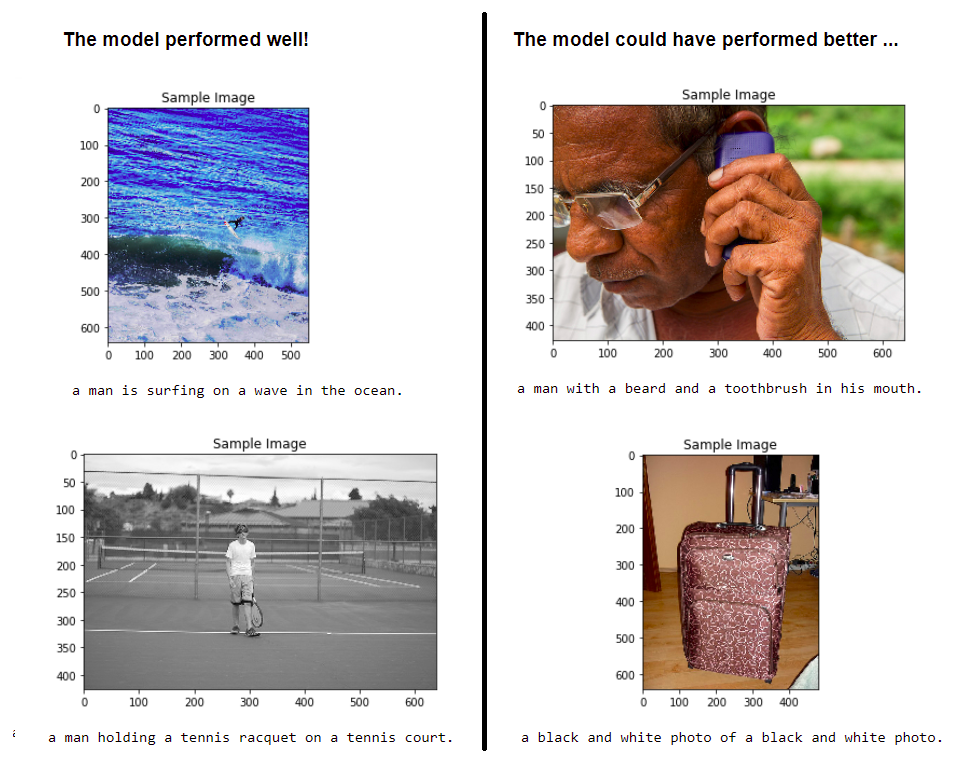

# Image Captioning

## Introduction
The repository contains a Sequence-to-Sequence model, which can automatically generate captions from images.

## Network Architecture
The solution architecture consists of:
1. CNN encoder, which encodes the images into the embedded feature vectors:
  
2. Decoder, which is a sequential neural network consisting of LSTM units, which translates the feature vector into a sequence of tokens:
 

The Project has been reviewed by Udacity and graded. Meets Specifications against the
following [rubric](https://github.com/udacity/CVND---Image-Captioning-Project/blob/master/README.md).

## Sample output:

<!--  Yet to try Attention based models and/or Transformers for performing better image captioning. -->